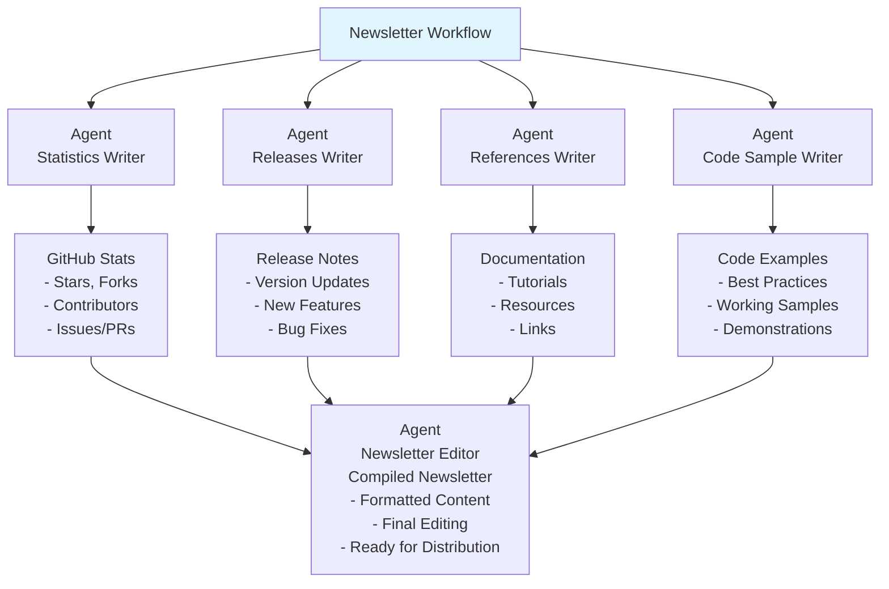

# Agentic Newsletter Generator

Multi-agent Java system that generates monthly technology newsletters using real-time data and intelligent content curation

This project creates an intelligent newsletter generation system using multiple specialized AI agents that work together to produce monthly technology newsletters. Built in Java 21 using Quarkus 3.28.0, LangChain4j 1.8.0, LangChain4j Agentic for agent orchestration, MCP servers and Azure AI Foundry with various language models, this agentic application automatically gathers GitHub statistics (stars, forks, releases), analyzes community engagement, summarizes release notes, curates code examples, and compiles everything into a newsletter ready for email distribution. Each agent has a specific role - data collection, content analysis, writing, and formatting - creating a scalable solution for technology companies, developer communities, and tech enthusiasts who want to stay informed about specific technologies without manual research.

## Technology Stack

- **Java 21** - Target runtime version
- **Quarkus 3.28.0** - Web framework for all agent modules
- **LangChain4j 1.8.0** - AI/LLM integration and agentic orchestration
- **Maven** - Multi-module build system
- **Azure AI Foundry** - Cloud AI service with Phi-4 and GPT model deployments
- **GitHub MCP Server** - Model Context Protocol for GitHub data integration
- **Tinylog 2.7.0** - Logging framework

## Agents



### Code Sample Agent

Generates one snippet of Java code that demonstrates the latest features and best practices of LangChain4j being covered in the newsletter. This agent analyzes recent releases and documentation to create practical, working code samples.

### References Agent

Gathers and curates comprehensive reference documentation, tutorials, and helpful resources related to LangChain4j. This agent identifies the most valuable learning materials, official documentation links, and community resources for newsletter readers.

### Releases Agent

Analyzes and summarizes recent software releases, including version updates, new features, bug fixes, and breaking changes. This agent processes release notes and changelog information to provide clear, digestible summaries of what's new.

### Statistics Agent

Collects and analyzes GitHub statistics such as star counts, fork numbers, contributor activity, issue resolution rates, and community engagement metrics. This agent provides quantitative insights into project health and growth trends.

### Newsletter Editor Agent

Compiles and formats all content from the specialized agents into a cohesive, well-structured newsletter. This agent takes the raw output from statistics, releases, references, and code sample agents and creates the final newsletter with proper formatting, flow, and editorial polish ready for distribution.

## Getting Started

### Prerequisites

- Java 21 or later
- Maven 3.8+
- Azure AI Foundry account with deployed models
- GitHub Personal Access Token (for MCP integration)

### Environment Variables

Before running the application, set the following environment variables (or in an `.env` file at the project root):

```bash
# Azure AI Foundry configuration
export AZURE_AI_FOUNDRY_KEY="your-azure-ai-foundry-api-key"
export AZURE_AI_FOUNDRY_ENDPOINT="https://your-endpoint.openai.azure.com/openai/deployments/"

# GitHub MCP Server configuration
export GITHUB_PERSONAL_ACCESS_TOKEN="your-github-personal-access-token"
```

### Building the Project

```bash
# Build all modules
mvn clean package

# Build and run tests
mvn clean verify
```

### Running the Newsletter Generator

Run the complete workflow to generate a newsletter:

```bash
cd workflow-newsletter
mvn exec:java -Dexec.mainClass="ai.agentic.newslettergen.workflow.NewsletterGenerator"
```

Or run in Quarkus dev mode for hot reload:

```bash
cd workflow-newsletter
./mvnw quarkus:dev
```

### Running Individual Agents

Each agent can be run independently for testing:

```bash
# Run statistics agent in dev mode
cd agent-statistics
./mvnw quarkus:dev

# Run code sample agent
cd agent-code-sample
./mvnw quarkus:dev

# Run newsletter editor agent
cd agent-newsletter-editor
./mvnw quarkus:dev
```

## Project Structure

This is a multi-module Maven project with the following structure:

- **agent-statistics** - Collects GitHub statistics using MCP
- **agent-reference** - Gathers reference documentation
- **agent-release** - Analyzes release notes
- **agent-code-sample** - Generates code examples
- **agent-newsletter-editor** - Compiles final newsletter
- **workflow-newsletter** - Orchestrates all agents using LangChain4j Agentic
- **commons** - Shared utilities and constants
- **samples** - Standalone examples for testing
- **infrastructure/** - Azure deployment scripts

Each agent is a self-contained Quarkus application with its own dedicated Azure AI model deployment. The workflow-newsletter module depends on all agent modules and orchestrates them in sequence using LangChain4j's Agentic framework.

## Infrastructure

This project is designed to run on Azure AI Foundry with automated infrastructure deployment scripts.

### Azure AI Foundry Setup

The system uses Azure AI Foundry for hosting AI models with individual model deployments for each agent:

- **Agent Statistics Writer**: Collects GitHub repository metrics
- **Agent Releases Writer**: Analyzes software release information
- **Agent References Writer**: Curates documentation and resources
- **Agent Code Sample Writer**: Generates practical code examples
- **Agent Newsletter Editor**: Compiles and formats the final newsletter
- **Newsletter Workflow**: Orchestrates all agents to produce the final newsletter

### Deployment

```bash
# Deploy all Azure resources
./infrastructure/create-azure-ai-foundry-resources.sh

# Clean up resources when done
./infrastructure/delete-azure-ai-foundry-resources.sh
```

The deployment creates:

- Azure Resource Group (`rg-hack2025agenticnews{username}`)
- Azure AI Foundry service with multiple model deployments
- Individual model deployments for each specialized agent:
    - **agent-code-sample-writer-model**: Phi-4 (Microsoft format)
    - **agent-reference-writer-model**: Phi-4 (Microsoft format)
    - **agent-release-writer-model**: gpt-5-mini (OpenAI format)
    - **agent-statistics-writer-model**: Phi-4 (Microsoft format)
    - **agent-newsletter-editor-model**: Phi-4 (Microsoft format)
- Required environment variables for service connectivity

### GitHub Integration

Uses [GitHub MCP Server](https://github.com/github/github-mcp-server) via Model Context Protocol for:

- Repository statistics and metrics collection
- Release notes and changelog access
- Documentation and code sample extraction
- Community engagement analysis

The Docker image is located at https://github.com/github/github-mcp-server/pkgs/container/github-mcp-server.

```bash
docker run -i --rm \
  -e GITHUB_PERSONAL_ACCESS_TOKEN=$GITHUB_PERSONAL_ACCESS_TOKEN \
  -e GITHUB_TOOLSETS="all" \
  ghcr.io/github/github-mcp-server
```

## References

* LangChain4j
    * [LangChain4j](https://docs.langchain4j.dev)
    * [LangChain4j Agents and Agentic AI](https://docs.langchain4j.dev/tutorials/agents)
* GitHub
    * [GitHub MCP Server](https://github.com/github/github-mcp-server)
* Azure AI Foundry
    * [Azure AI Foundry feature availability across clouds regions](https://learn.microsoft.com/azure/ai-foundry/reference/region-support)
    * [Use model router for Azure AI Foundry](https://learn.microsoft.com/azure/ai-foundry/openai/how-to/model-router)
* Azure CLI
    * [Create and configure all the resources for Azure AI Foundry Models](https://learn.microsoft.com/azure/ai-foundry/foundry-models/how-to/quickstart-create-resources?pivots=programming-language-cli)
    * [az cognitiveservices](https://learn.microsoft.com/cli/azure/cognitiveservices)

# Example of a Newsletter generated by the system

## LangChain4j Newsletter – May 2025

This newsletter helps you stay tuned for the latest features of LangChain4j

### What is LangChain4j?

[LangChain4j](https://docs.langchain4j.dev/) is an open-source library that simplifies the integration of AI and Large Language Models (LLMs) into Java applications. It provides a unified API for interacting with various model providers and embedding stores, along with tools for prompt templating, memory management, and high-level patterns like RAG (Retrieval-Augmented Generation).

#### Some Numbers

* [LangChain4j main GitHub repository](https://github.com/langchain4j/langchain4j):
    * GitHub repository created in May 2023
    * 7.7k stars, 100 watching, 1.4K forks
    * 221 contributors
    * 939 closed issues, 1,359 closed Pull Requests
    * Used by 1.4K other repositories
* Integration:
    * Supports 19 model providers (Azure OpenAI, OpenAI, Amazon Bedrock…)
    * Supports 28 embedding stores (Azure AI Search, Cassandra, MongoDB…)
    * Integrates with 4 Java runtimes (Quarkus, SpringBoot, Helidon, Micronaut)

### What's New Since the Last Newsletter?

The last LangChain4j newsletter was sent in October 2024. Since then, the project has achieved a major milestone with the release of version 1.0.0 and introduced significant architectural improvements and new features:

* **Revamped** Chat API: New ChatModel.chat(...) API replacing deprecated ChatLanguageModel.generate(...) methods
* **MCP**: LangChain4j now includes initial implementation of the Model Context Protocol client and tool provider.
* **Enhanced** Model Support: Support for OpenAI O1/O3 models, audio inputs, official Java SDK integration. Support for Azure OpenAI passwordless authentication, latest SDK versions.
* **Structured** Outputs: Enhanced JSON schema support with more return types and optional fields by default
* **Integrations**: MariaDB embedding store, enhanced MongoDB Atlas support

### Release Pace

LangChain4j continues its rapid development with frequent releases:

* [1.0.1](https://github.com/langchain4j/langchain4j/releases/tag/1.0.1) released in May 2025
* [1.0.0](https://github.com/langchain4j/langchain4j/releases/tag/1.0.0) released in April 2025
* [1.0.0-rc1](https://github.com/langchain4j/langchain4j/releases/tag/1.0.0-rc1) released in April 2025
* [1.0.0-beta3](https://github.com/langchain4j/langchain4j/releases/tag/1.0.0-beta3) released in April 2025
* [1.0.0-beta2](https://github.com/langchain4j/langchain4j/releases/tag/1.0.0-beta2) released in March 2025
* [1.0.0-beta1](https://github.com/langchain4j/langchain4j/releases/tag/1.0.0-beta1) released in February 2025
* [1.0.0-alpha1](https://github.com/langchain4j/langchain4j/releases/tag/1.0.0-alpha1) released in December 2024
* [0.36.2](https://github.com/langchain4j/langchain4j/releases/tag/0.36.2) released in November 2024
* [0.36.1](https://github.com/langchain4j/langchain4j/releases/tag/0.36.1) released in November 2024

### Azure AI Support

Azure support continues to be a priority with several Microsoft contributors actively improving the integration. Recent Azure AI enhancements include:

* Structured outputs support in streaming mode
* Passwordless authentication capabilities
* Enhanced Azure OpenAI integration with latest SDK versions
* Improved Azure AI Search content retriever with metadata preservation
* Azure OpenAI (full support with latest features)
* Azure Blob Storage (document loading)
* Azure CosmosDB (embedding store)
* Azure AI Search (vector search and retrieval)
* Azure AI Foundry and Foundry Local (through OpenAI APIs)

The project maintains an automatic Azure label system in GitHub for tracking Azure-related issues and pull requests, making it easier to follow developer needs for Azure support:

* [34 issues are still open](https://github.com/langchain4j/langchain4j/labels/Azure)
* [213 issues are closed](https://github.com/langchain4j/langchain4j/issues?q=label%3AAzure+is%3Aclosed)
* [7 PRs are still waiting to be merged](https://github.com/langchain4j/langchain4j/pulls?q=is%3Apr+label%3AAzure+is%3Aclosed)
* [159 PRs have been merged](https://github.com/langchain4j/langchain4j/pulls?q=is%3Apr+label%3AAzure+is%3Aclosed)

### Other Models Support

Other major model providers have also significantly invested in enhancing their LangChain4j integrations.

* **Google Vertex AI**: Enhanced Google AI Gemini support with embedding models, Google Cloud Storage document loader integration, Improved Vertex AI streaming capabilities with custom headers
* **Amazon Bedrock**: Significant Bedrock improvements with Converse API, Enhanced tool calling and streaming support, Nova model integration with tool execution requirements, Cohere embeddings support on Bedrock
* **OpenAI**: Full migration to official OpenAI Java SDK, Support for latest model releases (O1/O3), Enhanced audio input capabilities, Improved structured outputs

### Some Code

Here's how to use the new 1.0.0 ChatModel API to access a DeepSeek model deployed locally on [Foundry Local](https://github.com/microsoft/Foundry-Local) using the Azure OpenAI API:

```java
ChatModel model = OpenAiChatModel.builder()
    .baseUrl("http://localhost:5273/v1")
    .modelName("deepseek-r1-distill-qwen-14b-generic-gpu")
    .build();

String answer = model.chat("What is the best Pink Floyd album?");
System.out.

println(answer);
```

### References

If you are interested in learning more about LangChain4j and its Azure support, here are some helpful resources:

* [LangChain4j main GitHub repository](https://github.com/langchain4j/langchain4j)
* [LangChain4j documentation](https://docs.langchain4j.dev/)
* [LangChain4j Discord channel](https://discord.gg/Q8rGAztc)
* Azure support:
    * [Azure OpenAI](https://github.com/langchain4j/langchain4j/tree/main/langchain4j-azure-open-ai)
    * [Azure AI Search](https://github.com/langchain4j/langchain4j/tree/main/langchain4j-azure-ai-search)
    * [Azure CosmosDB](https://github.com/langchain4j/langchain4j/tree/main/langchain4j-azure-cosmos-nosql)
    * [Azure Blob Storage](https://github.com/langchain4j/langchain4j/tree/main/document-loaders/langchain4j-document-loader-azure-storage-blob)
